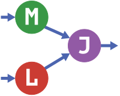

## Machine Learning(ML) in Julia using MLJ

  On my learning journey in ML and Julia, I followed and worked on [MLJ](https://alan-turing-institute.github.io/MLJ.jl/stable/) tutorials and "ported" them into [Pluto](https://juliapackages.com/p/pluto) notebooks.

The original presentation was made during the `JuliaCon2020`, and all the reference materials, can be found here:

    

<em>These tutorials were prepared for use in a 3 1/2 hour online workshop at JuliaCon2020, recorded</em>
[JuliaCon 2020 | MLJ: A Machine Learning Toolbox for Julia](https://www.youtube.com/watch?time_continue=27&v=qSWbCn170HU&feature=emb_title). 
<em>Their main aim is to introduce the</em>
[MLJ](https://alan-turing-institute.github.io/MLJ.jl/stable/) <em>machine learning toolbox to data scientists.</em>

<em>Mar. 2021 Corto Inc</em>

